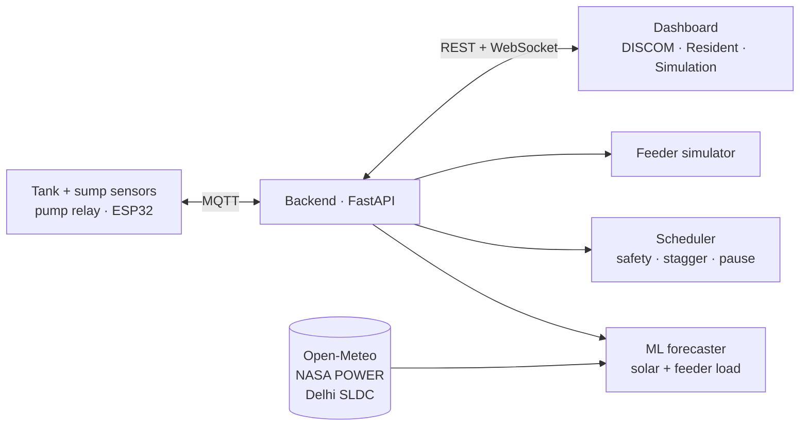

# Virtual Tank Battery

**Turning India's rooftop water tanks into a neighbourhood-scale battery for renewable intermittency.**
Schneider Electric hackathon · Challenge 03: Grid Reliability

> *"India already owns millions of batteries. They're on its rooftops, filled with water."*

---

## The idea

- India is adding solar and wind fast, but their output dips with clouds and evenings. When supply drops, weak urban and peri-urban feeders see outages first.
- Grid-scale batteries are expensive and slow to reach those areas. DISCOMs need **cheap, local flexibility** at the feeder level.
- Almost every Indian building already has a **ground sump, a pump and an overhead tank**. Pumping is a large but flexible load: it doesn't matter *when* water is pumped, as long as the tank never runs dry.
- So empty tank space acts like stored energy. **Pump during solar surplus, pause during dips.** Thousands of tanks together form a virtual battery the grid already owns.

## How it works



- **Retrofit controller** (₹500–800): senses tank level, sump level and pump power, and switches the existing pump through a relay. It protects the pump locally even if the internet drops.
- **Forecasting:** LightGBM models trained on a year of real Delhi data predict solar output and feeder load 15 minutes to 6 hours ahead.
- **Scheduler:** pumps in green hours, pre-fills before forecast dips, never lets a tank fall below a safe level, protects the pump from running dry, and staggers motor starts to avoid voltage dips.
- **DISCOM dashboard:** live State of Charge (kWh of shiftable pumping), forecasts, and a one-tap **Pump Pause** for demand response.
- **Resident view:** tank level, pump status in plain language, and dry-run and overflow alerts.

## Repository layout

| Folder | What's inside |
|---|---|
| [`vtb-backend/`](vtb-backend/) | FastAPI server, MQTT bus, ML forecasting, scheduler, simulator, data pipelines, tests |
| [`vtb-frontend/`](vtb-frontend/) | React + Tailwind + Recharts dashboard (light/dark themes, mobile-friendly) |

## Quick start

You need Python 3.11+ and Node 18+. No broker, database server or API keys are required; mock telemetry runs automatically.

**Backend** (Windows PowerShell; on macOS/Linux use `source .venv/bin/activate`):

```powershell
cd vtb-backend
python -m venv .venv
.venv\Scripts\activate
pip install -r requirements.txt
uvicorn app.main:app --reload --port 8000
```

API docs: http://localhost:8000/docs

**Dashboard** (in a second terminal):

```powershell
cd vtb-frontend
npm install
npm run dev
```

Dashboard: http://localhost:5173

**Tests:** `cd vtb-backend` and then `python -m pytest -q`

To connect real ESP32s, start the backend with `VTB_MQTT_URL=mqtt://<broker>:1883`; the mock switches itself off. The MQTT and REST contract is in [`vtb-backend/docs/api_contract.md`](vtb-backend/docs/api_contract.md).

## Data: what's real

| Data | Source | |
|---|---|---|
| Solar irradiance (training) | [NASA POWER](https://power.larc.nasa.gov) hourly, Delhi | ✅ Real |
| Weather forecasts (training + live) | [Open-Meteo](https://open-meteo.com) archived + live forecasts | ✅ Real |
| Feeder load (training + live) | [Delhi SLDC](https://www.delhisldc.org) 5-min DISCOM load (BYPL) | ✅ Real |
| Building water demand | CPHEEO norm of 135 L/person/day, Indian daily usage pattern | ⚠️ Synthetic |
| Tank telemetry | In-process mock until the hardware is connected | ⚠️ Mock |

The full list is in [`vtb-backend/data/SOURCES.md`](vtb-backend/data/SOURCES.md).

**Forecast accuracy** (held-out weeks across all seasons):

| Forecast | Our model | Best simple baseline |
|---|---|---|
| Solar, 1–6 h ahead | **45.9 W/m²** error | 70.6 (raw weather forecast) |
| Feeder load, 15 min – 6 h ahead | **5.8%** error | 7.1% (same time yesterday) |

## Simulated impact

300 buildings on one Delhi feeder, on a typical October day (real NASA solar, real BYPL load shape, 0.75 HP pumps, CPHEEO water demand). The same water is scheduled three ways:

| | Today | VTB controller | Best possible (LP) |
|---|---|---|---|
| Pumping powered by solar | 41% | **95%** | 100% |
| Pumping in the evening peak (6–11 pm) | 17.4 kWh | **0 kWh** | 0 kWh |
| Peak pump load | 25 kW | 41 kW | 58 kW |
| Feeder net peak | 306 kW | **300 kW (−2%)** | 300 kW |
| Time any tank was below its safe level | 0% | **0%** | — |

- **60 kWh/day** of pumping moves into solar hours, about **20 MWh/day per 1 lakh buildings**.
- The controller **fills the midday valley** instead of starting every pump at once, so it never creates a new peak.
- The effect on the feeder's overall peak is modest (−2%), because household demand dominates the evening peak. The value is in *flexible, controllable* load: green-hour pumping, evening relief and instant pause capacity.

Explore other building counts and a real cloudy day in the dashboard's Simulation tab.

## Status

- [x] Hardware/software interface contract (MQTT + REST)
- [x] Backend: IST-correct scheduling, MQTT bridge, sump-based dry-run protection
- [x] Forecasting on real Delhi data with live feeds and offline fallbacks
- [x] Dashboard: DISCOM, Resident and Simulation views
- [x] Scheduler v2: fixed tick, municipal supply sync, per-feeder SoC
- [x] Simulator: today's behaviour vs VTB controller vs LP optimum, on real Delhi solar and load data
- [ ] Impact, resident savings (₹) and demo-control endpoints
- [ ] Physical model integration (ESP32, pumps, sensors)

## Team

| Role | Owner |
|---|---|
| Hardware & firmware | Shashwat Rajan |
| Backend, ML & scheduling | Abhiraj Agarwal |
| Dashboard & demo | Gaurav Rai |
